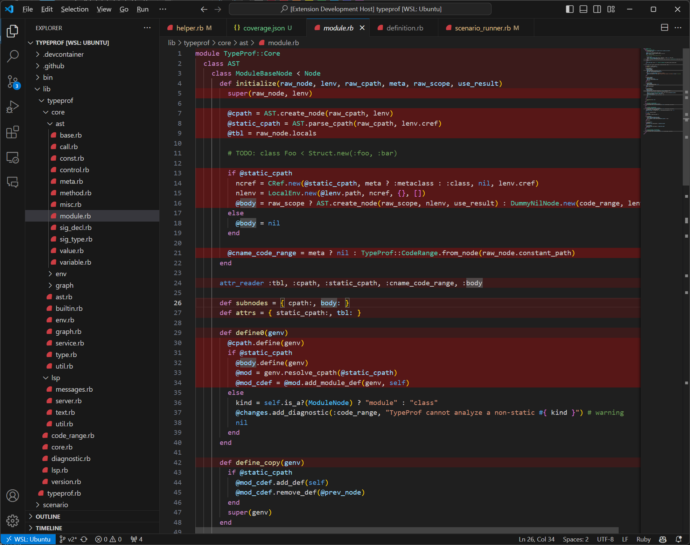

# vscode-akainaa

vscode-akainaa is a Visual Studio Code extension that emphasis executed line by integration with akainaa gem.

## Features

Highlight executed line.



## Requirements

Set [akainaa](https://github.com/riseshia/akainaa) with online_emit option. For example:

```ruby
Akainaa.start(
  project_dir: File.expand_path(__dir__),
  ignore_glob_patterns: %w[
    config/application.rb
    config/initializers/*_initializer.rb
  ],
  online_emit: {
    mode: :file,
    interval: 1, # seconds
    output_path: 'tmp/coverage.json',
    trap_at_exit: true,
  },
)
```

## Commands

- `Reset coverage result`: Clear coverage result, so all red lines will be removed.

## Extension Settings

to be supported

## Release Notes

Go to [CHANGELOG.md](./CHANGELOG.md)
